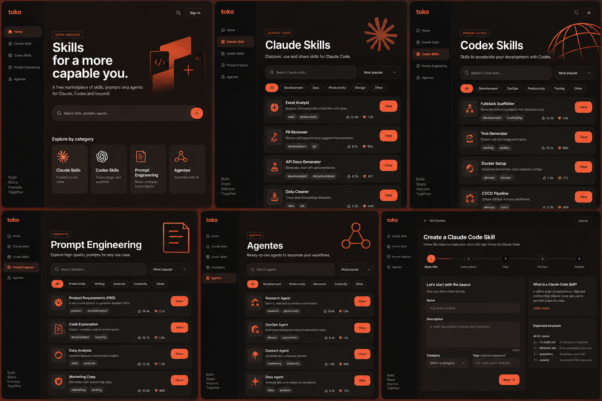

# 🧩 Skill Hub — Free Skills Marketplace

> Blueprint completo para implementar um marketplace gratuito de **Claude Skills**, **Codex Skills**, **Prompt Engineering** e **Agentes**, com um **Skill Builder em formato wizard** focado em Claude Code.



**No ar:** <https://felipeaguiarcode.github.io/skillhub/>

Publicado por GitHub Pages a partir da branch `main`. Não há build: os arquivos
servidos são os do repositório.

## ✅ Aplicação implementada

A aplicação final vive na **raiz do repositório** e está completa (gates 1 a 8 de `docs/IMPLEMENTATION_GATES.md`):

```text
index.html
assets/
├── css/   01-tokens · 02-base · 03-layout · 04-components · 05-pages · 06-utilities · 07-responsive
├── js/    core · icons · formats · zip · components · catalog · router · pages/* · builder/* · app
└── og-cover.svg
```

### 🎯 Um formato por ferramenta

`assets/js/formats.js` é a fonte única do que cada ferramenta espera. O catálogo e o
Skill Builder leem daí, então o app nunca oferece um campo que a ferramenta de
destino não aceita:

| | Claude Code | Codex |
|---|---|---|
| **Artefato** | `<nome>/SKILL.md` (diretório) | `AGENTS.md` **ou** `~/.codex/prompts/<nome>.md` |
| **Frontmatter** | ~20 campos opcionais | `AGENTS.md`: **nenhum** · prompt: só `description` e `argument-hint` |
| **Acionamento** | `/nome`, auto-invocável | `AGENTS.md`: automático por diretório · prompt: `/prompts:nome` |
| **Placeholders** | `$ARGUMENTS`, `$N`, `$nome`, `${CLAUDE_*}` | `$1`–`$9`, `$ARGUMENTS`, `$MAIUSCULO`, `$$` |
| **Limite** | manter abaixo de 500 linhas | 32 KiB (`project_doc_max_bytes`) |
| **Passos do wizard** | 7 | prompt: 5 · `AGENTS.md`: 4 |

Existe ainda um quarto formato, **prompt portátil**: como `description` e
`argument-hint` são os dois únicos campos do prompt do Codex *e* dois campos
válidos do Claude Code, um prompt limitado a eles instala nas duas ferramentas
sem alterar uma linha do arquivo.

### Como executar

Não há build, npm, nem etapa de compilação. Qualquer uma das três formas funciona:

```bash
# 1. abrir direto, sem servidor (ADR-004)
#    duplo clique em index.html

# 2. servidor estático local
python -m http.server 8000
# depois: http://localhost:8000

# 3. qualquer host de arquivos estáticos
```

### Coleções e rotas

```text
#/home                      hero, categorias, destaque, recentes
#/claude-skills             coleção Claude Code
#/codex-skills              coleção Codex (AGENTS.md e prompt)
#/prompt-engineering        prompts portáteis
#/coding-styles/<id>        guias de estilo por stack
#/agents                    agentes
#/skill-builder             wizard de criação
#/skill/<id>                detalhe de uma Skill
#/what-is-a-skill/<passo>   apresentação de 20 passos, estilo Prezi
```

Duas rotas merecem nota:

- **`#/coding-styles`** lê guias de estilo que moram **fora** do repositório, em
  `~/.claude/coding-styles/`. Como o navegador não lê aquele caminho e o app não
  faz `fetch`, o texto entra como dado estático gerado por
  `node tools/gen-coding-styles.js`.
- **`#/what-is-a-skill`** é uma apresentação com câmera sobre um canvas único: o
  quadro tem o tamanho da área útil, então um passo que enquadra um quadro fica
  em escala 1 — em repouso é uma página responsiva comum, e a câmera só
  acrescenta o movimento entre passos.

### Deploy estático

O projeto usa **apenas caminhos relativos** e **hash routing**, então funciona em domínio raiz e em subpasta sem nenhuma regra de rewrite:

| Destino | O que fazer |
|---|---|
| **GitHub Pages** | Settings → Pages → Deploy from a branch → `/ (root)`. Funciona em `usuario.github.io/repo/`. |
| **Cloudflare Pages** | Build command vazio, output directory `/`. |
| **Netlify** | Publish directory `.`, sem build command. |
| **Vercel** | Framework preset "Other", output directory `.`. |
| **Qualquer host** | Copiar `index.html` e `assets/` para a raiz pública. |

Não configure nada de servidor: não há rotas de servidor, não há API, não há variável de ambiente e não há segredo no repositório.

### O que já está pronto

- seis áreas de navegação, hash routing com 404 real, `aria-current` e voltar/avançar do navegador;
- **sidebar colapsável** com animação de deslizar, estado guardado em `skillhub.ui.v1`;
- catálogo estático de 28 entradas, cada uma escrita no formato real da sua ferramenta;
- busca global, busca por coleção, filtros combináveis (categoria, **formato**, plataforma, risco, scripts, shell, popularidade), quatro ordenações e filtros recolhíveis em tablet/mobile;
- detalhe que explica o formato: arquivo, frontmatter, acionamento, placeholders, limite de tamanho e os caminhos reais de instalação de cada ferramenta;
- Skill Builder que **pergunta a ferramenta primeiro** e adapta passos, campos, nome do arquivo e caminhos; validação por passo, scores de risco e portabilidade explicados, rascunho em `localStorage` e exportação com ZIP em JS puro onde o formato tem diretório;
- favoritos locais, toasts em região `aria-live`, foco visível, `prefers-reduced-motion` e responsividade de 360 a 1920 px.

---

## 🎯 Objetivo

Este pacote foi preparado para ser usado como base de implementação com **Claude Code**. A solução foi deliberadamente limitada a:

- ✅ HTML
- ✅ CSS
- ✅ JavaScript puro
- ✅ Arquivos estáticos
- ✅ `localStorage` apenas para preferências e rascunhos locais
- ❌ Sem login
- ❌ Sem backend
- ❌ Sem banco de dados
- ❌ Sem framework frontend
- ❌ Sem etapa de build obrigatória

O projeto pode ser aberto localmente e também hospedado em qualquer serviço de site estático.

## 🧭 Navegação obrigatória

A navegação principal deve conter exatamente estas áreas:

1. **Home**
2. **Claude Skills**
3. **Codex Skills**
4. **Prompt Engineering**
5. **Agentes**
6. **Skill Builder**

## 🛠️ Skill Builder

O Skill Builder é a principal ferramenta da plataforma. Ele deve funcionar como um wizard visual para criar uma Skill compatível com Claude Code, cobrindo:

- identidade e nome da skill;
- descrição e gatilhos;
- argumentos;
- regras de invocação;
- ferramentas permitidas/restritas;
- execução inline ou em contexto fork;
- instruções Markdown;
- arquivos auxiliares;
- validação;
- preview da estrutura final;
- exportação.

O perfil padrão deve gerar uma estrutura semelhante a:

```text
my-skill/
├── SKILL.md
├── reference.md          # opcional
├── examples.md           # opcional
└── scripts/              # opcional
    └── helper.sh
```

## 📚 Conteúdo do pacote

```text
toko-skill-marketplace-blueprint/
├── README.md
├── CLAUDE.md
├── docs/
│   ├── PRD.md
│   ├── ADR.md
│   ├── DESIGN_SYSTEM.md
│   ├── SKILL_BUILDER_SPEC.md
│   ├── IMPLEMENTATION_GATES.md
│   └── QA_CHECKLIST.md
├── design-system/
│   ├── index.html
│   └── assets/
│       ├── css/
│       └── js/
├── prototype/
│   ├── index.html
│   └── assets/
│       ├── css/
│       └── js/
└── reference/
    └── concept-ui.png
```

## 🚀 Como começar com Claude Code

1. Abra esta pasta como projeto.
2. Inicie o Claude Code na raiz.
3. Peça para ele ler primeiro `CLAUDE.md`.
4. Depois trabalhe gate a gate seguindo `docs/IMPLEMENTATION_GATES.md`.
5. Não permita que ele avance para o próximo gate sem validar os critérios de saída do gate atual.

Uma boa primeira instrução é:

```text
Leia CLAUDE.md, docs/PRD.md, docs/ADR.md, docs/DESIGN_SYSTEM.md e docs/IMPLEMENTATION_GATES.md.
Implemente somente o Gate 1. Não antecipe funcionalidades de gates posteriores.
Ao terminar, faça a validação completa dos critérios de saída e me entregue uma checklist.
```

## 🧪 Preview incluído

O diretório `design-system/` contém uma página de referência visual dos tokens e componentes.

O diretório `prototype/` contém um protótipo estático navegável, sem backend, que demonstra:

- sidebar;
- Home;
- listagens;
- filtros;
- cards;
- Skill Builder;
- geração de preview de `SKILL.md`;
- persistência local do rascunho.

## 🔒 Modelo de segurança

O marketplace **não executa Skills**. Ele apenas exibe, inspeciona, copia e exporta arquivos. Qualquer Skill que declare ferramentas, comandos shell ou permissões deve mostrar essas capacidades de forma explícita antes do download.

## 📌 Fontes técnicas

Os formatos gerados pelo app foram conferidos contra a documentação oficial de
cada ferramenta:

- **Claude Code Skills** — <https://code.claude.com/docs/en/skills>
  (`SKILL.md`, frontmatter YAML, `.claude/skills/`, arquivos auxiliares,
  `${CLAUDE_*}`, limite de description + `when_to_use`)
- **Codex AGENTS.md** — <https://developers.openai.com/codex/guides/agents-md>
  (Markdown puro, precedência de `AGENTS.override.md`, `project_doc_max_bytes`)
- **Codex custom prompts** — <https://developers.openai.com/codex/custom-prompts>
  (`~/.codex/prompts/`, sem subdiretórios, só `description` e `argument-hint`,
  placeholders `$1`–`$9` / `$ARGUMENTS` / `$MAIUSCULO` / `$$`)

Como as duas ferramentas evoluem rápido, reconfira essas páginas antes de
ampliar os campos em `assets/js/formats.js` — é o único arquivo que precisa
mudar para acompanhar a documentação.
